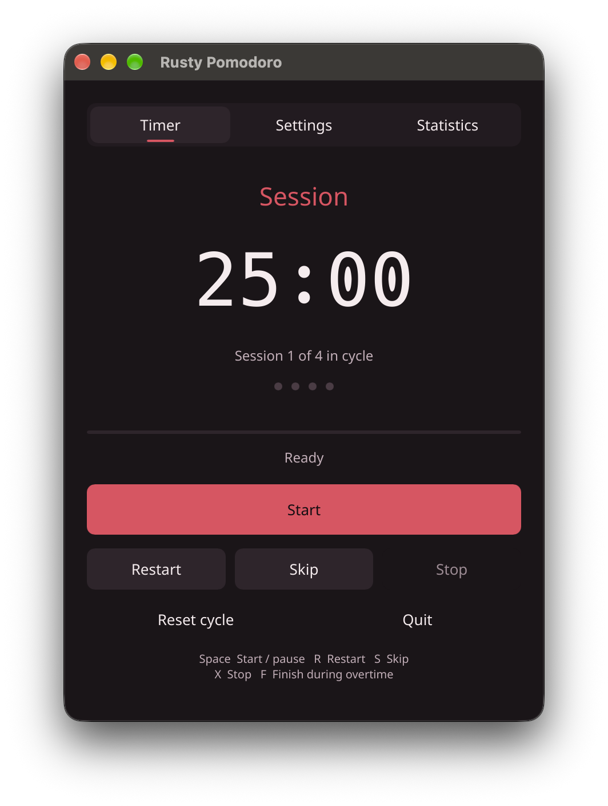
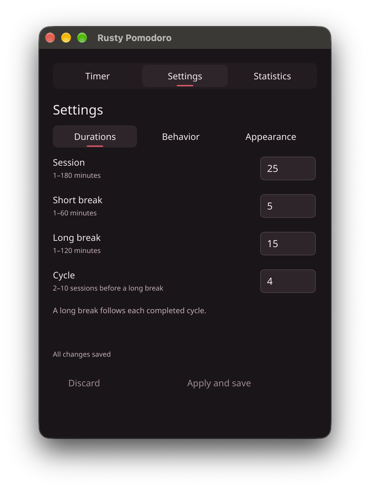
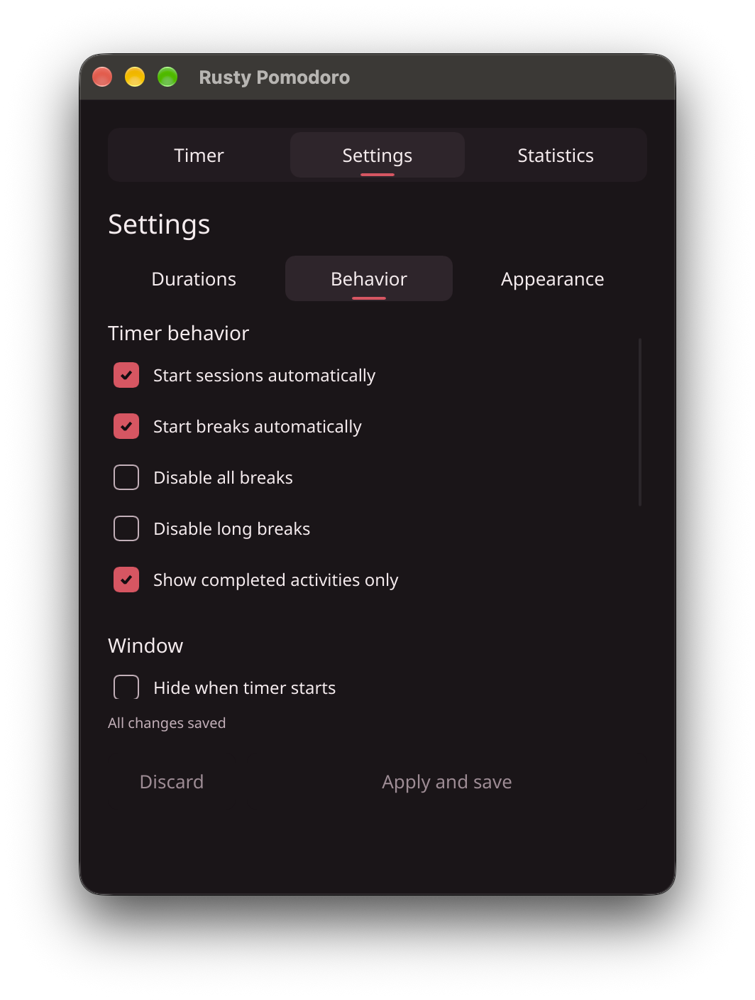
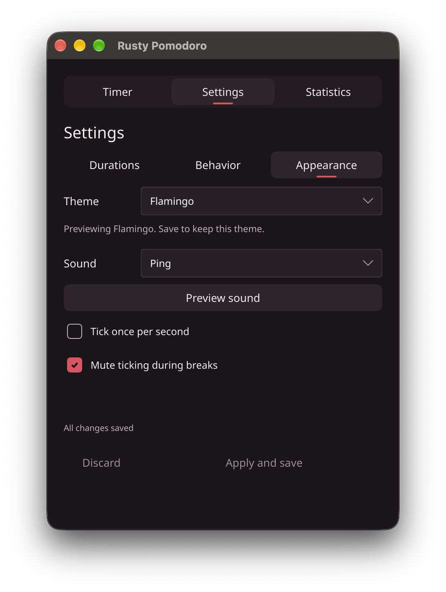
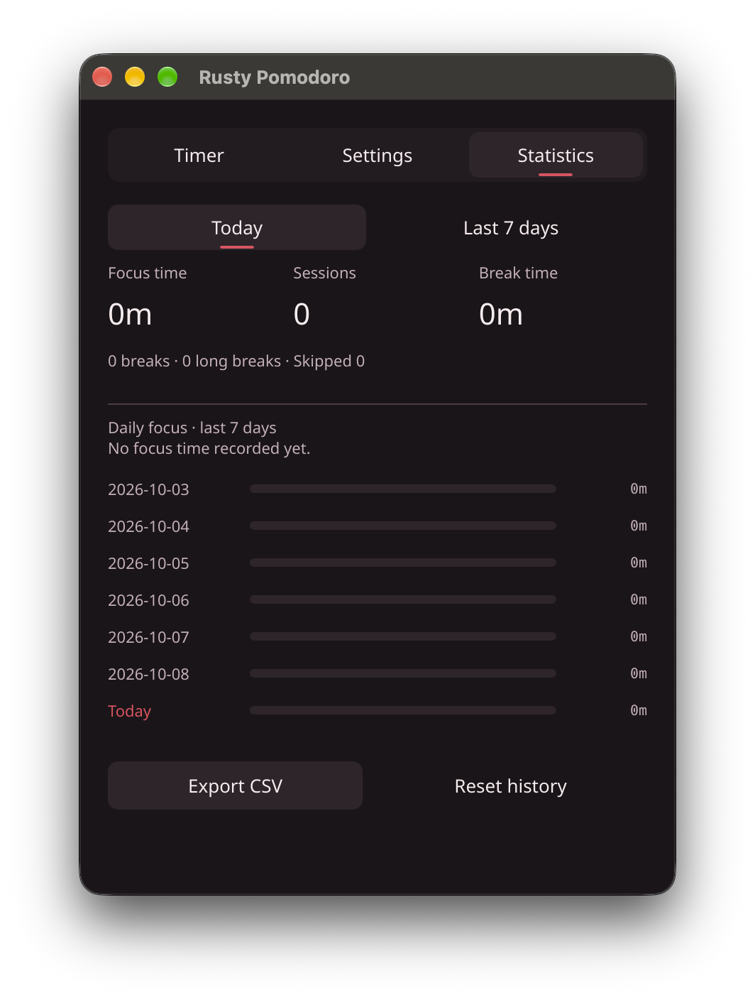

# Rusty Pomodoro

**[Product website](https://aungmyokyaw.github.io/rusty-pomodoro/)**

[](LICENSE)


A Rust Pomodoro desktop app rebuilt from the behavior of the installed Tomito app.

Slint is the default UI on macOS, Windows, and Linux. macOS retains tray, Dock, sound, shortcut, and sleep/wake integrations. Windows and Linux builds exist, but runtime behavior is not tested.

## Quick start

Run the shared UI locally:

```sh
make dev
```

Build the Slint macOS app and open it:

```sh
make package-macos
open "dist/Rusty Pomodoro.app"
```

The app includes focus and break timers, configurable cycles, themes, shortcuts, and day/week statistics with CSV export. See [Development](docs/DEVELOPMENT.md) for build targets, platform details, and validation.

## Screenshots

<table>
  <tr>
    <td align="center"><strong>Timer</strong><br></td>
    <td align="center"><strong>Settings · Durations</strong><br></td>
  </tr>
  <tr>
    <td align="center"><strong>Settings · Behavior</strong><br></td>
    <td align="center"><strong>Settings · Appearance</strong><br></td>
  </tr>
  <tr>
    <td align="center"><strong>Statistics</strong><br></td>
    <td></td>
  </tr>
</table>

## Project docs

- [Architecture and UX review](docs/ARCHITECTURE.md)
- [Behavior inventory and parity gaps](docs/REVERSE_ENGINEERING.md)
- [Performance measurements](docs/PERFORMANCE.md)

This is not a complete pixel-identical or AppleScript-compatible replacement. No original executable or proprietary assets are included.

## License

Licensed under the GNU Affero General Public License v3.0 or later. See [LICENSE](LICENSE).
